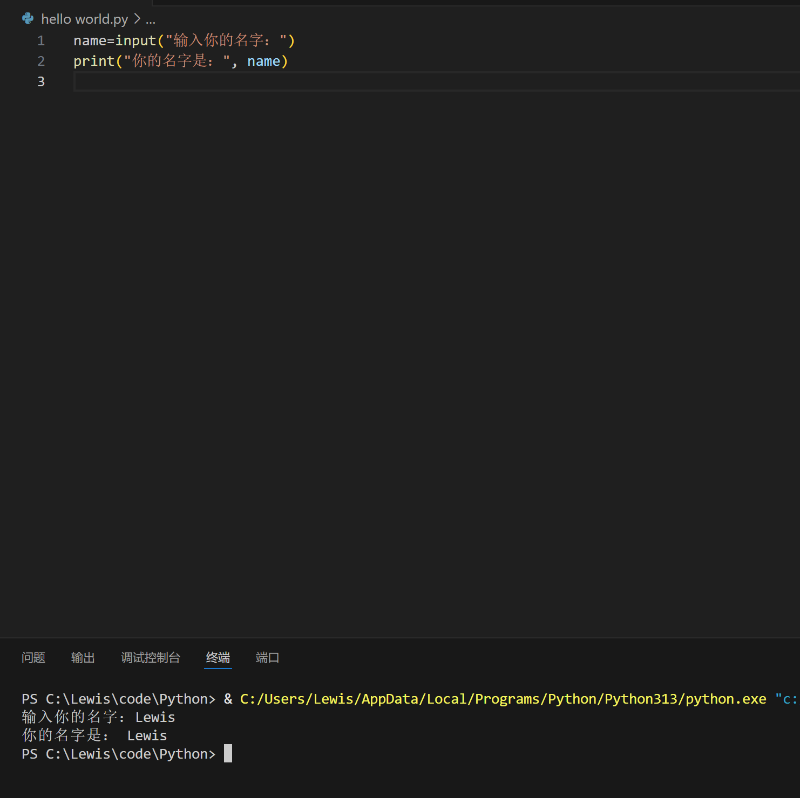

### 输出

用 `print()`在括号中加上字符串，就可以向屏幕上输出指定的文字。比如输出 `'hello, world'`，用代码实现如下：

```python
print('hello, world')
```

`print()` 函数也可以接受多个字符串，用逗号“,”隔开，就可以连成一串输出：

```python
print('The quick brown fox', 'jumps over', 'the lazy dog')
```

输出结果为

```
The quick brown fox jumps over the lazy dog
```

`print()`会依次打印每个字符串，遇到逗号“,”会输出一个空格，因此，输出的字符串是这样拼起来的：

The quick brown fox jumps over the lazy dog


`print()`也可以打印整数，或者计算结果：

```python
>>> print(300)
300
>>> print(100 + 200)
300
```

因此，我们可以把计算 `100 + 200` 的结果打印得更漂亮一点：

```python
>>> print('100 + 200 =', 100 + 200)
100 + 200 = 300
```


> 注意，对于100 + 200，Python解释器自动计算出结果300，但是，'100 + 200 ='是字符串而非数学公式，Python把它视为字符串。

### 输入

现在，你已经可以用 `print()`输出你想要的结果了。但是，如果要让用户从电脑输入一些字符怎么办？Python提供了一个 `input()`，可以让用户输入字符串，并存放到一个变量里。比如输入用户的名字：

```python
name=input("输入你的名字：")
```

当你输入`name=input("输入你的名字：")`并按下回车后，这时，你可以输入任意字符，然后按回车后完成输入。

输入完成后，不会有任何提示，那我们刚才输入的内容到哪去了？答案是存放到`name`变量里了。可以直接输入下方代码查看变量内容：

```Python
name=input("输入你的名字：")
print("你的名字是：", name)
```




**什么是变量？** 请回忆初中数学所学的代数基础知识：

设正方形的边长为`a`，则正方形的面积为`a x a`。把边长`a`看做一个变量，我们就可以根据a的值计算正方形的面积，比如：

若`a=2`，则面积为`a x a = 2 x 2 = 4`；

若`a=3.5`，则面积为`a x a = 3.5 x 3.5 = 12.25`。

在计算机程序中，变量不仅可以为整数或浮点数，还可以是字符串，因此，`name`作为一个变量就是一个字符串。

### 小结

任何计算机程序都是为了执行一个特定的任务，有了输入，用户才能告诉计算机程序所需的信息，有了输出，程序运行后才能告诉用户任务的结果。

输入是`Input`，输出是`Output`，因此，我们把输入输出统称为`Input/Output`，或者简写为`IO`。

`input()`和`print()`是在命令行下面最基本的输入和输出，但是，用户也可以通过其他更高级的图形界面完成输入和输出，比如，在网页上的一个文本框输入自己的名字，点击“确定”后在网页上看到输出信息。

